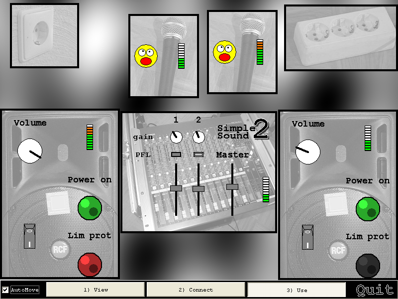

# SimStagecraft

Branch|
---|---
`master`|

Tool to simulate stagecraft (connecting sound and light) using the C++ VCL library

 * [Download the Windows executable](http://richelbilderbeek.nl/ToolSimStagecraftExe.zip)
 * Video's: [YouTube](https://youtu.be/qvfJYq54BUI) [.ogv](http://richelbilderbeek.nl/sim_stagecraft.ogv)

